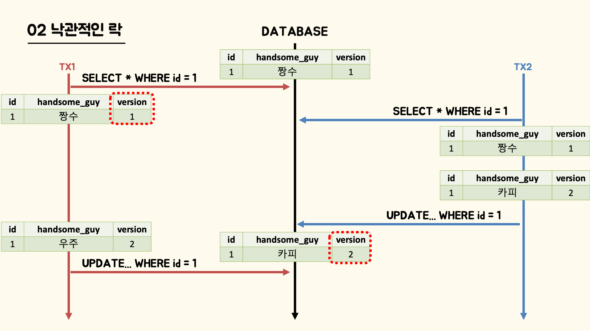
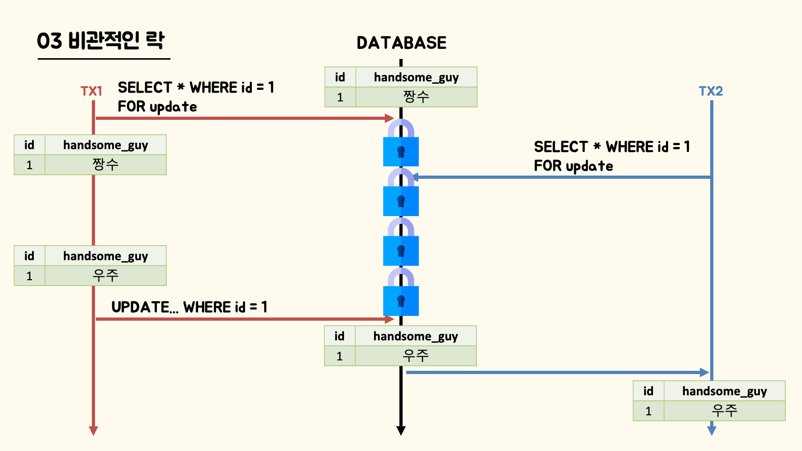
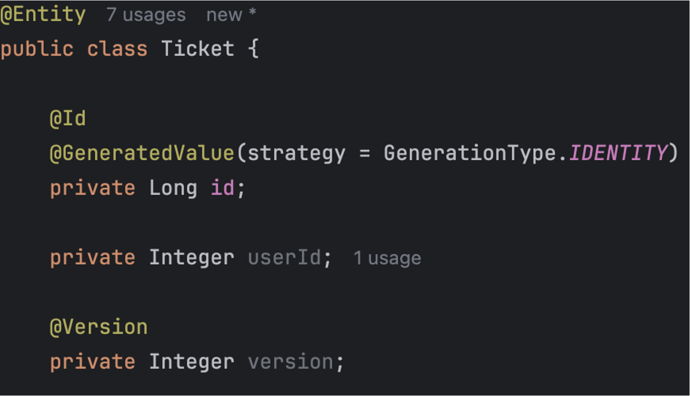
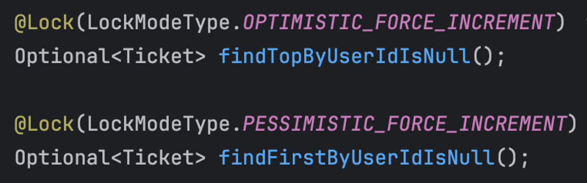
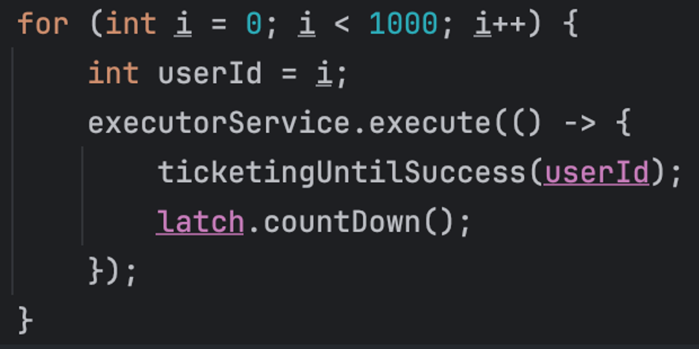

# 낙관적 락, 비관적 락을 통한 동시성 제어
#### 작성자: 우주(김성현)

## 1. 개요
동시성 이슈는 데이터를 다루는 개발자라면 누구나 한번쯤 거쳐가게 되는 하나의 큰 산이다. 동시성을 잘 다루지 못하는 백앤드 개발자는 불 조절을 못하는 요리사와 같다고도 할 수 있다. 혹시 ‘동시성이 뭐지?’라거나 ‘개념은 아는데 어떻게 적용하는 거지?’라고 생각했다면 환영하다. 이 글은 아직 동시성 제어를 접해보지 못한 개발자, 동시성 제어에 대해 막 배웠지만 어떻게 해결해야 하는지 모르는 개발자를 위해 쓰여졌다. 까맣게 타버린 요리를 손님에게 내어주고 싶지 않다면 이 글을 차분히 읽고 성장할 수 있기를 바란다.

## 2. 사양
- 언어: JAVA 17
- DB: H2
- ORM: SPRING DATA JPA

## 3. 동시성 제어
정의부터 살펴보자. **동시성 제어란, 데이터 무결성을 침해하지 않고 동시에 트랜잭션을 처리할 때 이를 제어하는 방법의 총칭**이다. 즉, 트랜잭션을 동시에 처리하면서도 데이터는 온전한 상태를 유지하는 것이라 할 수 있다. 

트랜잭션을 동시에 처리한다는 게 무슨 뜻일까? 놀이공원 롤러코스터 관리자 샘의 예시를 살펴보자. 새롭게 롤러코스터 관리자로 취임한 샘은 걱정이 많다. 얼마나 걱정이 많은지 ‘나중에 출발한 롤러코스터가 앞 롤러코스터라 부딪히면 어떻게 하지?’라고 생각해버린다. 샘은 선로에 하나의 롤러코스터만 있도록 정책을 바꿨다. 자, 어떤 결과가 벌어졌을까? 한 시간 동안 롤러코스터를 탈 수 있는 사람이 줄어들었고, 당연하게도 롤러코스터를 기다리는 시간이 몇 배나 길어졌다. 긴 줄에 지친 손님들은 그 놀이동산에 다시 가지 않게 되었다. 트랜잭션의 ACID 원칙에 있어, Isolation은 중요한 특성이다. 그러나 관리자 샘처럼 Isolation 특성(부딪히는 사고 방지)을 너무 중요시하면 손님(유저)가 없어지게 된다. 즉, 동시에 작업을 처리하면서도 Isolation을 유지하는 게 데이터베이스 성능의 관건인 것이다. 

DB에서 동시성 제어는 작업에 결함이 없으면서도 빠른 속도를 요구하는 배경 아래 탄생했다. 이 글에서 설명하는 것 외에도 다양한 동시성 제어 방식이 존재한다. 여기에서는 필자가 생각하는 실용적이고 관련 자료가 많은 낙관적인 락과 비관적인 락 방식에 대해 설명하겠다.

## 4. 두 번의 갱신 분실
티켓팅 사이트 개발자인 당신은 경력이 긴 시니어 개발자라 쉽게 동시성 제어 기능을 구현헸다. 하나의 티켓을 여러명이 동시에 요청하더라도 한 명만 티켓팅에 성공한다.
이제 SQL문과 함께 살펴보자. 티켓팅에는 어떤 쿼리가 생길까?

```SQL
UPDATE SET ticket.user_id = ? WHERE ticket.id = ?
```

SQL을 배웠다면 위와 같은 간단한 쿼리를 쉽게 생각해낼 수 있다. 티켓팅 서비스에서는 위 쿼리들을 동시에 수행하면서도 하나의 쿼리만 성공하도록 만들어야 한다. 만일 하나의 쿼리라도 추가 실행된다면 기존에 있던 user_id값을 수정하게 되는 참사가 발생한다. 이러한 문제를 `두 번의 갱신 분실` 문제라고 한다.
결국 동시성 제어는 `두 번의 갱신 분실` 문제를 막기 위한 방지책이라고도 할 수 있는 것이다. 이제 동시성 제어가 어떻게 동작하는 지는 몰라도 역할은 제대로 이해했으리라 믿는다. 자, 이제부터 세부 동작 원리에 대해 살펴보자.

## 5. 낙관적인 락
낙관적인 락이란, 테이블에 버전 컬럼을 추가해 해당 트랜잭션이 올바른 순서를 지켰는지 확인하는 방식으로 동작하는 동시성 제어이다. 흔히 프로그램이 업데이트 될 때 이전 빌드와 구분하기 위해 붙이는 v.1.0.0과 같은 관리 번호라고 생각해도 좋다. 버전값은 자연수, 해시값, 타임스탬프 등 이전 상태와 구분할 수 있는 데이터 타입을 사용한다. 그럼 어떻게 올바른 순서를 지켰는 지 확인할 수 있을까? 먼저 트랜잭션을 처리할 때마다 버전을 업데이트한다. 하나의 트랜잭션이 commit 되면서 버전을 올리게 된다. 동시에 실행 중인 트랜잭션들은 이전 버전을 업데이트하고 있는 셈이 된다. `낙관적인 락` 방식에서는 이러한 이전 버전에 대한 업데이트를 받아들이지 않고 예외를 던진다. 일반적으로 `낙관적인 락` 방식에서 실패한 트랜잭션은 최신 버전으로 다시 업데이트를 시도한다.(개발자가 어플리케이션 레벨에서 직접 처리하는 경우가 많다)
글로만 보면 이해하기 힘들 수 있으니 예시와 함께 살펴보자.



데이터베이스에는 `handsome_guy : 짱수`라는 값이 들어가 있다고 가정하겠다. 데이터에 있는 version 컬럼을 주목하면서 흐름을 따라가보자. 먼저 트랜잭션 1번이 해당 데이터를 가져왔다. 뒤이어 트랜잭션 2번도 해당 데이터를 가져왔다. 그러나 트랜잭션 2번이 먼저 `handsome_guy : 카피`로 데이터를 업데이트하여 커밋하게 된다. 이에 따라 version값도 1에서 2로 증가하였다. 뒤늦게 트랜잭션 1번도 `handsome_guy : 우주`로 업데이트를 수행하지만, 기존에 읽어온 데이터의 버전은 1, 현재 데이터베이스에 있는 데이터의 버전은 2다. 즉, 이전 버전에 대한 업데이트 트랜잭션이므로 예외를 던지며 트랜잭션 1번은 롤백된다. 이와 같은 흐름을 가진 제어 방식을 낙관적인 락이라 부르는 것이다.

## 6. 비관적인 락
이번엔 비관적인 락에 대해 알아보자. 비관적인 락은 데이터베이스 락(LOCK)을 사용하는 동시성 제어 방법이다. 데이터베이스 락에 대한 이해가 선행되어야 비관적인 락을 이해할 수 있는 것이다.

데이터베이스 락이란, 테이블이나 레코드 등 데이터에 잠금을 걸어 접근, 수정 등을 제한하는 수단이다. 대표적으로 **읽기 잠금(S-LOCK)** 과 **쓰기 잠금(X-LOCK)** 이 있다. 읽기 잠금은 데이터를 읽을 때 획득해야 하는 잠금이다. 하나의 데이터에 대해 읽기 잠금은 동시에 획득할 수 있다. 즉, 하나의 데이터를 다른 트렌잭션이 동시에 읽을 수 있는 것이다. 반면, 쓰기 잠금은 데이터를 쓸 때(수정, 삭제할 때) 획득해야 하는 잠금이다. 쓰기 잠금은 베타적 잠금이라 하여, 해당 데이터에 대해 오로지 하나의 쓰기 잠금만 걸 수 있는 것이다. 그렇다면, 읽기 잠금과 쓰기 잠금이 동시에 적용되면 어떤 일이 벌어질까? 읽기 잠금과 쓰기 잠금은 먼저 걸린 잠금이 우선 적용되고, 나중에 걸린 잠금은 걸리지 않게 된다. 간단하게 표로 정리해보았다.


비관적인 락 방식도 위와 마찬가지로 예시와 함께 살펴보자.



글을 잘 읽었다면 handsome_guy 예시가 이미 익숙할 것이다. 트랜잭션이 각각 값을 가져오는 과정에서 차이점이 있다면 SQL문에 `FOR UPDATE`라는 단어가 붙어 있다는 점이다. 이 `FOR UPDATE`는 데이터베이스에게 ‘나 이제부터 가져온 데이터를 변경할 예정이니까 잠금을 걸어줘’라고 얘기하는 것이다. 요청에 따라 데이터베이스는 해당 데이터에 쓰기 잠금을 걸게 된다. 쓰기 잠금은 다른 잠금과 동시에 획득하는 것이 불가능하기에 다른 트랜잭션은 해당 잠금이 풀릴 때까지 기다릴 수 밖에 없다. 트랜잭션 1번이 `handsome_guy : 우주`로 데이터를 업데이트하고 잠금을 해제한 뒤에야 트랜잭션 2번이 데이터에 접근이 가능해지는 것이다. 이와 같이 데이터베이스 락을 사용하는 동시성 제어 방식을 비관적인 락이라고 부른다. 비관적인 락 방식의 제어 방식은 간단하다. 하나의 요청마다 데이터에 락을 걸어놓고 작업을 수행하고, 작업이 완료되면 락을 해제하는 과정을 반복하며 진행하는 것이다.

## 7. 낙관적인 락 vs 비관적인 락
앞선 글에서 낙관적인 락과 비관적인 락에 대해 알아보았다. 그렇다면 이제 우리가 탐구해야할 방향은 언제, 어떤 동시성 제어 방법을 채택해야 하는가이다. 장인은 언제나 상황에 맞는 도구를 선택하여 작업을 진행한다. 우리도 소프트웨어 장인이 되기 위해 언제 어떤 도구를 선택해야 하는지에 대한 기준을 몸에 익혀나가야 한다.

결론부터 말하면 **낙관적인 락은 충돌이 발생할 확률이 낮을 때, 비관적인 락은 충돌이 발생할 확률이 높을 때** 적용하면 된다. 이제부터 천천히 그 이유를 뜯어보자. 낙관적인 락은 버전 정보를 통해 동시성을 제어한다. 데이터베이스에 직접적인 락을 걸지 않더라도 동시성에 대한 정보를 버전 데이터가 제시하고 있기 때문에, 락을 걸 이유가 없는 것이다. 반대로 비관적인 락은 데이터베이스 락 없이는 동시성을 제어할 수 없다. 일반적으로 데이터베이스 락은 비용이 큰 작업이기 때문에 상대적으로 속도가 느릴 수 밖에 없다. 여기까지 설명하면 ‘낙관적인 락이 항상 좋은 것 아닌가?’라는 생각이 들 수도 있지만 위에서 잠깐 언급하고 넘어간, [재시도]에 주목해볼 필요가 있다.

낙관적인 락 방식은 해당 트랜잭션이 이전 버전일 경우 예외를 발생시킨다고 하였다. 그렇다면 어플리케이션 개발자는 이 예외를 어떻게 처리하는 게 좋을까? 1. 사용자에게 예외가 발생했다고 알린다. 이 방식은 절대 좋을 수 없다. 쇼핑몰에서 구매 버튼을 눌렀을 때 몇 번이고 실패가 된다고 상상해보라. 2. 최신 버전으로 트랜잭션을 다시 수행한다. 낙관적인 락에서 일반적으로 선택하는 구현 방식이다. 그러나, 이러한 방식에도 숨겨진 함정이 있다. 100개의 트랜잭션이 동시에 수행될 때 낙관적인 락 방식으로 동시성 제어를 하게 된다면 어떤 일이 벌어질까? 먼저 1개의 트랜잭션이 성공한다 나머지 99개의 트랜잭션은 이전 버전에 대한 업데이트이므로 예외를 던지며 로직에 따라 재시도 하게 될 것이다. 다시 99개 중 1개의 트랜잭션이 성공하고 98개가 재시도 될 것이다. 정말 끔찍하지 않은가?

위와 같은 상황에서 비관적인 락은 하나씩 차근차근 작업을 수행한다. 재시도 비용이 높을수록 비관적인 락의 강점이 커지는 것이다. 후술할 테스트 코드를 통해 상황에 따라 비관적인 락이 더 빠른 속도로 동작한다는 것을 확인할 수 있다. 앞선 결론대로, 충돌이 적으면 낙관적인 락, 충돌이 많으면 비관적인 락을 사용하자. 많다, 적다의 기준은 각자 다를 수 있고 경험이 축적되면 어느 정도 감이 생길 것이다.

## 8. JPA에서 적용 방법
SPRING DATA JPA에서는 간단한 어노테이션을 통해 낙관적인 락과 비관적인 락을 구현할 수 있다.



먼저 낙관적인 락을 구현하기 위해서는 엔티티에 버전을 나타낼 필드가 필요하다. `@Version` 어노테이션을 통해 쉽게 버전을 만들 수 있고, 위에서 말했듯이 타임 스탬프나 해시값으로도 구현할 수 있다. 여기서는 숫자로 구현해보았다.



낙관적인 락, 비관적인 락 방식 모두 `@Lock` 어노테이션을 통해 아주 쉽게 쿼리문을 작성할 수 있다. LockModeType에는 크게 묶어 OPTIMISTC(낙관적), PESSIMISTIC(비관적)으로 분류할 수 있으며, 다른 값에 대해서는 직접 찾아보기 바란다.
 

## 9. 테스트 코드
다음은 테스트 코드다. 이 테스트는 충돌이 많이 발생할 때, 낙관적인 락과 비관적인 락의 성능이 어떻게 나타나는 지를 알기 위해 작성되었다. 1,000개의 요청이 동시에 들어온다고 가정하고 요청을 처리하는 데 걸리는 시간을 비교해보았다.



executorService로 보내진 ticketingUntilSuccess는 유저 아이디로 티켓팅을 하는 메서드이다. 이름에서 알 수 있듯이 성공할 때까지 재시도하는 로직이 포함되어 있다. 비관적인 락의 경우에는 재시도하는 로직이 필요 없지만, 있어도 영향을 주지 않는다는 판단 하에 그대로 두었다. CountDownLatch를 통해 스레드가 모든 작업을 끝낼 때까지 기다린 시간을 비교해보았다.

결과, 낙관적인 락: 10회 평균 1075ms, 비관적인 락: 10회 평균 509ms 정도의 수행 시간을 보여주었다. 재시도에 큰 비용이 드는 작업이 없음에도 불구하고 2배 가까운 속도 차이를 보여주었다. 테스트 결과는 컴퓨터 사양에 따라 달라질 수 있다. 

## 10. 출처
- Real My SQL 8.0 1편
- MySQL 공식 문서
- ’Voxxed Days’ Hibernate 개발자 발표 영상
(Transactions and Concurrency Control Patterns by Vlad Mihalcea)

